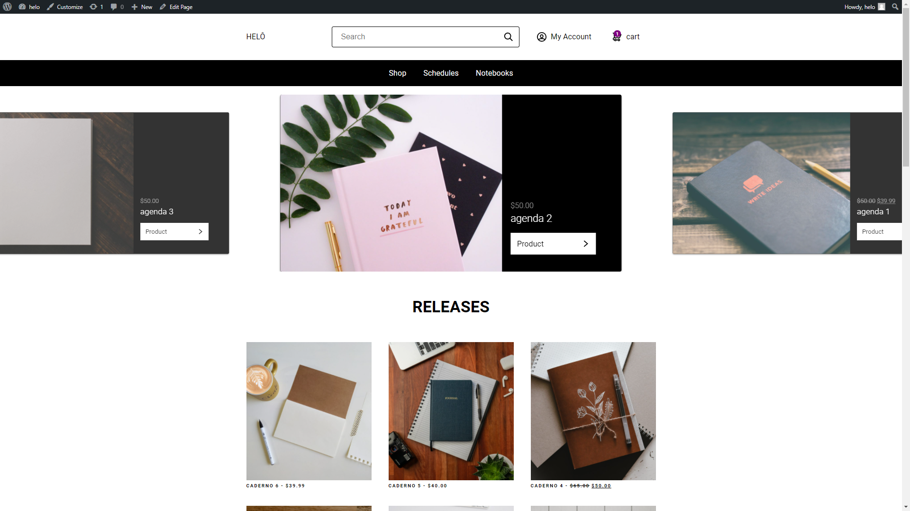
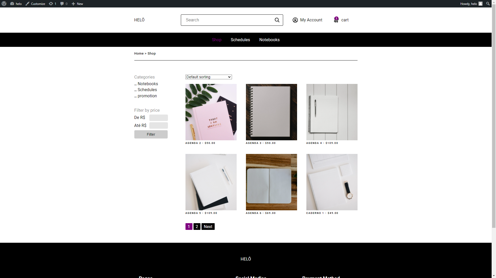
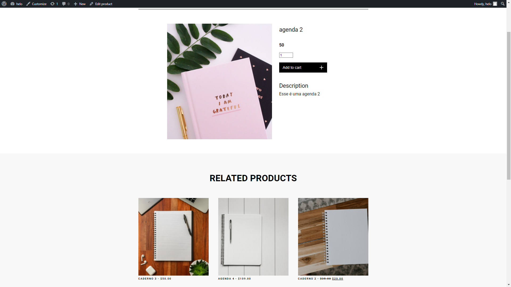

  <h1 align="center">Sobre o Projeto</h1>
  
Nesse projeto criei um site de venda, e-commerce, de produtos de encardernação. A principal ferramenta utilizada foi o wordpress, para que o cliente possa adicionar produtos,  com valores, promoções, categorias etc; além da adição de custom fields, para a melhor personalização do site pelo cliente sem a dependência de um programador. O PHP serviu para a criação de funções, criação de arrays, acesso a objetos tanto do Wordpress como do plugin woocommerce, e suas propriedades e seus métodos.O Javascript foi utilizado para a criação dos slides na home e da galeria de fotos de cada um dos produtos. No CSS foi usado principalmente o grid layout e flex box, para posicionar os elementos da melhor forma possível.   

  

  <h1 align="center">Layout do Site</h1>
  

     
  
 

  <h1 align="center">Tecnologias utilizadas</h1>
  <ul>
    <li>Wordpress</li>
    <li>PHP</li>
    <li>Javascript</li>
    <li>HTML</li>
    <li>CSS</li>
  </ul>

 <h1 align="center">Autor</h1>
 <h3>Miguel Vianna Feiteira</h3>
 
Email: miguelviannafeiteira@gmail.com

 
Linkedin: 

